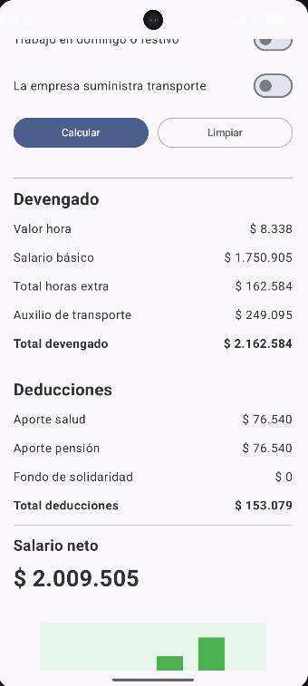
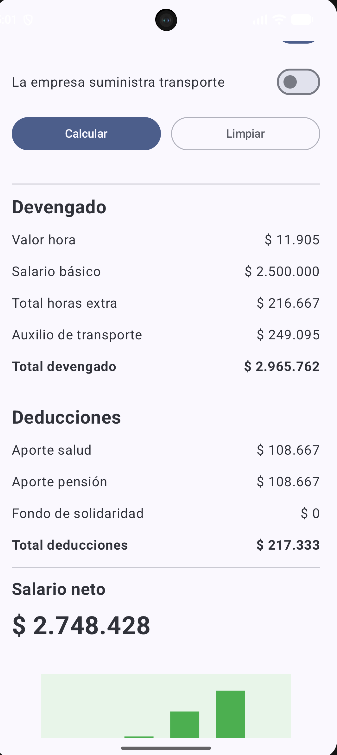
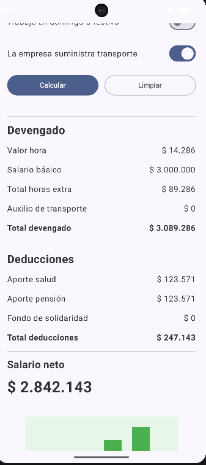
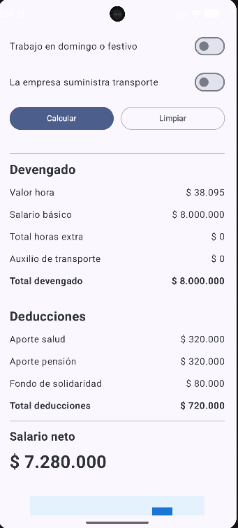
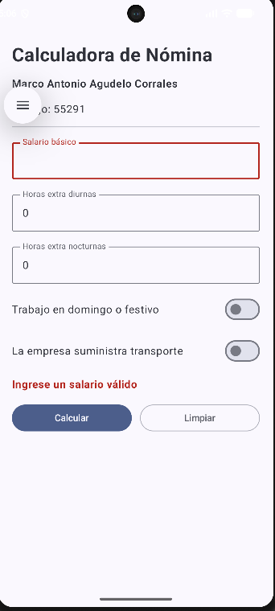

# Calculadora de Nómina Colombiana

Aplicación Android desarrollada en Kotlin utilizando Jetpack Compose, como parte del taller de Dispositivos Móviles.

## Información del estudiante

**Nombre:** Marco Antonio Agudelo Corrales  
**Código:** 55291

---

## Descripción

La Calculadora de Nómina Colombiana permite estimar el pago mensual de un trabajador a partir de su salario básico y las horas extra trabajadas durante el mes.

La aplicación permite ingresar:

- Salario básico mensual.
- Horas extra diurnas.
- Horas extra nocturnas.
- Trabajo de horas extra en domingo o festivo.
- Transporte suministrado por la empresa.

A partir de estos datos, la aplicación calcula y muestra:

- Valor de la hora ordinaria.
- Valor total de las horas extra.
- Auxilio de transporte.
- Total devengado.
- Aporte a salud.
- Aporte a pensión.
- Fondo de Solidaridad Pensional.
- Total de deducciones.
- Salario neto a recibir.
- Rango salarial del trabajador.

La aplicación también cuenta con validación de los datos ingresados y permite limpiar el formulario para realizar un nuevo cálculo.

---

## Tecnologías utilizadas

- Kotlin
- Android Studio
- Jetpack Compose
- Material 3
- Git
- GitHub

---

## Casos de prueba

La aplicación fue verificada utilizando los casos establecidos en el taller.

### Caso A - Salario mínimo con horas extra en día hábil

**Datos ingresados:**

- Salario básico: $1.750.905
- Horas extra diurnas: 10
- Horas extra nocturnas: 4
- Domingo o festivo: No
- Transporte suministrado por la empresa: No

**Salario neto obtenido:** $2.009.505

---

### Caso B - Horas extra en domingo o festivo

**Datos ingresados:**

- Salario básico: $2.500.000
- Horas extra diurnas: 6
- Horas extra nocturnas: 2
- Domingo o festivo: Sí
- Transporte suministrado por la empresa: No

**Salario neto obtenido:** $2.748.428

---

### Caso C - Transporte suministrado por la empresa

**Datos ingresados:**

- Salario básico: $3.000.000
- Horas extra diurnas: 5
- Horas extra nocturnas: 0
- Domingo o festivo: No
- Transporte suministrado por la empresa: Sí

**Salario neto obtenido:** $2.842.143

---

### Caso D - Salario alto con Fondo de Solidaridad Pensional

**Datos ingresados:**

- Salario básico: $8.000.000
- Horas extra diurnas: 0
- Horas extra nocturnas: 0
- Domingo o festivo: No
- Transporte suministrado por la empresa: No

**Salario neto obtenido:** $7.280.000

---

### Caso E - Validación de datos

Se comprobó el comportamiento de la aplicación al intentar realizar un cálculo sin ingresar un salario.

La aplicación detecta el dato inválido, marca el campo correspondiente y muestra el mensaje:

> **Ingrese un salario válido**

No se realiza el cálculo hasta que el usuario ingrese información válida.

---

## Evidencias de los Codelabs

Como parte del taller se realizaron los dos recorridos guiados de Android indicados.

### Codelab 1 - Dice Roller

Aplicación interactiva que permite lanzar un dado mediante un botón y modificar la imagen mostrada según el resultado obtenido.

**Repositorio de GitHub:**  
(https://github.com/MarcoAgudelo/Roller)

### Codelab 2 - Tip Time

Aplicación para calcular propinas utilizando entrada de datos, manejo de estado con Jetpack Compose y actualización dinámica de la interfaz.

**Repositorio de GitHub:**  
(https://github.com/MarcoAgudelo/TipTime---Marco-Agudelo)
---

## Ejecución del proyecto

1. Clonar o descargar este repositorio.
2. Abrir el proyecto en Android Studio.
3. Esperar la sincronización de Gradle.
4. Seleccionar un emulador o dispositivo Android.
5. Ejecutar la aplicación con Run App.

---

## Autor

**Marco Antonio Agudelo Corrales**  
**Código:** 55291

Taller de Dispositivos Móviles  
2026
